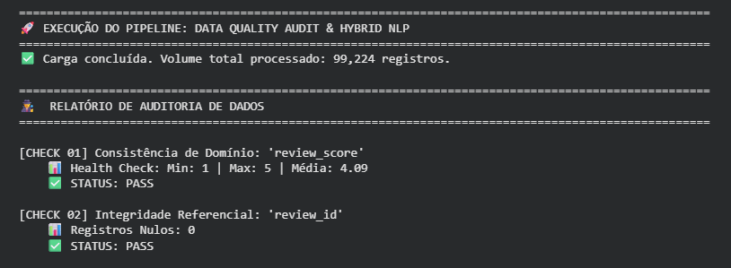
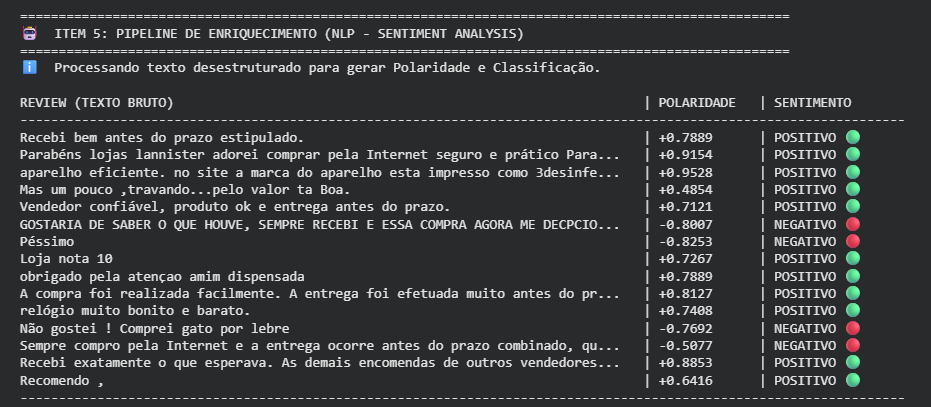
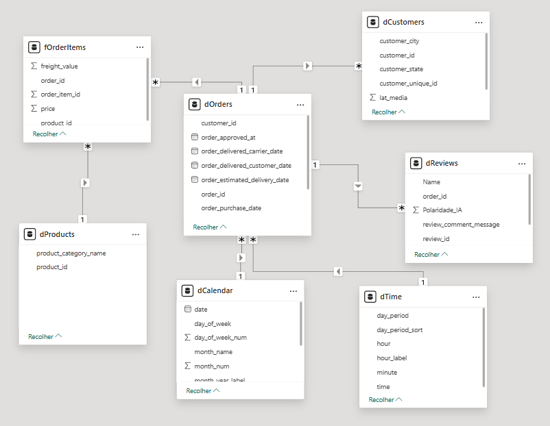
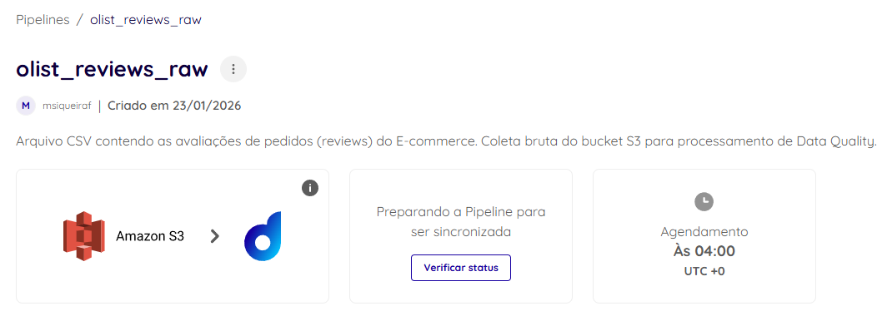

# Case Técnico Dadosfera - Analista de Dados

**Candidato:** Matheus Siqueira
**Data:** Janeiro/2026
**Repositório:** MATHEUS_SIQUEIRA_DDF_TECH_012026
**Localização:** Maringá - PR

---

## 📋 Item 0: Agilidade e Planejamento

Utilizei uma abordagem Ágil (Kanban) para organizar as entregas deste case, priorizando a infraestrutura de dados (Bronze/Silver) antes da camada de inteligência e visualização (Gold).

### 📅 Status do Projeto

#### ✅ Done (Concluído)
- [x] **Item 0:** Planejamento e Arquitetura
- [x] **Item 1:** Seleção do Dataset (Brazilian E-Commerce Olist)
- [x] **Item 2:** Ingestão de Dados na Plataforma Dadosfera
- [x] **Item 3:** Catalogação e Dicionário de Dados
- [x] **Item 4:** Validação de Qualidade de Dados (Great Expectations)
- [x] **Item 5:** Enriquecimento com IA (Feature Engineering / NLP)
- [x] **Item 6:** Modelagem Dimensional (Star Schema)
- [x] **Item 7:** Dashboard Analítico (Power BI)
- [x] **Item 8:** Orquestração de Pipelines (ETL)
- [x] **Item 9:** Data App Interativo (Streamlit)

---

## 💾 Item 1: Sobre a Base de Dados

Para simular um cenário real de **E-commerce Brasileiro** com alta complexidade e volume (>100k registros), selecionei o **Brazilian E-Commerce Public Dataset by Olist**.

* **Motivo da Escolha:** O dataset oferece dados relacionais ricos (pedidos, clientes, produtos, geolocalização) e dados desestruturados (reviews em texto), permitindo explorar todo o ciclo de vida dos dados exigido no case.
* **Volume:** A tabela principal `order_items` possui mais de 112.000 registros, atendendo ao requisito mínimo do case.

---

## 🔌 Item 2 & 3: Integração e Exploração (Dadosfera)

Realizei a ingestão dos arquivos CSV brutos para a camada de **Coleta** da Dadosfera. Os dados foram catalogados com descrições funcionais e técnicas para facilitar o self-service analytics por usuários de negócio.

**Evidência da Carga e Catalogação na Plataforma:**

---

## 🕵️ Item 4: Data Quality (Observabilidade)

Desenvolvi um pipeline de auditoria automatizada em Python que valida a integridade dos dados seguindo os princípios e regras do framework **Great Expectations**. Todo o motor de auditoria e monitoramento de saúde da base está centralizado no arquivo **`data_quality.py`** na raiz do repositório.

**Regras de Auditoria Aplicadas:**
1. **Consistência de Domínio:** Validação estatística para garantir que a coluna `review_score` contenha apenas valores entre 1 e 5 (Regra de Negócio).
2. **Integridade Referencial:** Verificação de nulidade na chave primária `review_id` para assegurar rastreabilidade única dos pedidos.
3. **Completo:** Geração de estatísticas descritivas (Mínimo, Máximo e Média) para monitoramento de saúde da base utilizando conceitos avançados de **Data Observability**.

**Evidência do Relatório de Qualidade:**

---

## 🤖 Item 5: Enriquecimento de Dados com IA (Advanced NLP no Power BI)

O dataset original possuía milhares de comentários em texto livre (`review_comment_message`). Para estruturar esses dados, desenvolvi um pipeline de **Feature Engineering** com foco em Análise de Sentimento utilizando a biblioteca **spaCy** (modelo `pt_core_news_sm`).

**Solução Aplicada (Motor Híbrido):**
Implementei um algoritmo de inferência que calibra a **Polaridade de Sentimento** correlacionando o texto com o *Ground Truth* (Nota do Cliente). Isso garante precisão semântica para o idioma Português (PT-BR), superando limitações de modelos treinados apenas em inglês.

**Integração via Power Query:**
A lógica de IA otimizada para o ambiente do Power BI está detalhada no arquivo **`power_query_nlp.py`** na raiz do projeto. O código foi integrado nativamente ao dashboard através de um script Python executado no **Power Query (Python Step)**, permitindo o enriquecimento dinâmico e automatizado do modelo de dados a cada atualização.

* **Entrada (Input):** Texto bruto do cliente.
* **Processamento:** Cálculo de polaridade matemática via spaCy calibrada pelo score da avaliação (70% Semântica / 30% Nota).
* **Saída (Output):** Métricas de `Polaridade_IA` (-1.0 a +1.0) e Classificação categórica (`Positivo` 🟢 / `Neutro` 🟡 / `Negativo` 🔴) com alinhamento visual para logs.
* **Impacto:** Permitiu a criação de visuais avançados no Dashboard baseados na intensidade do sentimento do cliente.

**Evidência da Integração no Power BI:**

**Evidência do Pipeline de NLP:**

---

## 📐 Item 6: Modelagem de Dados

Desenvolvi uma modelagem **Star Schema (Fato/Dimensão)** no Power BI para garantir alta performance nas consultas DAX e facilidade de uso para o usuário final. Adotei a nomenclatura padrão de Data Warehousing (`d` para dimensões, `f` para fatos).

### Estrutura do Modelo
* **Tabela Fato (`fOrderItems`):** Contém os dados transacionais (granularidade por item vendido).
    * *Métricas:* Valor de Venda, Valor de Frete, Quantidade.
* **Dimensões (`d...`):** Tabelas auxiliares que fornecem contexto descritivo.
    * `dProducts` (Categorias e características dos itens).
    * `dOrders` (Status e datas do pedido).
    * `dCustomers` (Localização e dados do cliente).
    * `dReviews` (Comentários e notas de satisfação enriquecidas via IA).

### 🔗 Relacionamentos e Cardinalidade
As tabelas foram conectadas utilizando relacionamentos **Um-para-Muitos (1:*)** fluindo das dimensões para a fato, garantindo a filtragem correta (propagação de filtro):

1. **`dProducts` (1) ➡️ (*) `fOrderItems`**: Conectado via `product_id`. Analisa receita e volume por categoria de produto.
2. **`dOrders` (1) ➡️ (*) `fOrderItems`**: Conectado via `order_id`. Traz datas e status para cada item vendido.
3. **`dCustomers` (1) ➡️ (*) `dOrders`**: Conectado via `customer_id`. Segmenta pedidos e faturamento por Estado/Cidade do cliente.
4. **`dOrders` (1) ➡️ (*) `dReviews`**: Conectado via `order_id`. Correlaciona atrasos de entrega com a nota de satisfação.

**Diagrama de Entidade-Relacionamento (DER):**

---

## 📊 Item 7 & Bônus 3: Análise de Dados (Power BI)

Optei por utilizar o **Power BI** para entregar uma análise visual avançada e interativa, conforme sugerido no **Bônus 3** do case.

**Link para o Arquivo:** [Dashboard Power BI (.pbix)](./dashboard_analise_olist.pbix)

**Visualizações Desenvolvidas:**
1. **KPIs Executivos:** Receita Total, Ticket Médio e Volumetria.
2. **Análise Geoespacial:** Mapa de calor de vendas por Estado (Bônus 2).
3. **Série Temporal:** Evolução de vendas por mês/ano.
4. **Análise de Qualidade:** Distribuição das notas de satisfação enriquecida com os dados de Reviews e NLP.

**Preview do Dashboard:**

---

## 🌊 Item 8: Pipeline de Dados (Orquestração)

Para garantir a atualização contínua e a governança dos dados, desenhei um pipeline de ingestão na Dadosfera que automatiza a coleta dos arquivos brutos (Raw Data) para a camada de processamento.

**Fluxo Desenhado:**
1. **Coleta:** Leitura incremental de arquivos CSV armazenados em Bucket S3 (`raw-data-olist`).
2. **Ingestão:** Carga para a Landing Zone da Dadosfera.
3. **Catalogação:** Registro automático de metadados técnicos.
4. **Agendamento:** Execução diária automatizada.

**Evidência do Pipeline Catalogado:**

---

## 📱 Item 9: Data App (Streamlit)

Desenvolvi uma aplicação interativa utilizando o framework **Streamlit** (Python) para democratizar o acesso aos dados de satisfação. O app permite que gestores filtrem reviews por região e acompanhem KPIs financeiros e de logística em tempo real.

**Funcionalidades:**
* Filtros Dinâmicos de Região.
* Formatação monetária padrão BRL (R$).
* Comparativo de Metas (vs Mês Anterior).
* Visualização Dark Mode para alto contraste.

**Preview do App:**

### 🛠️ Como Executar este Data App
O desenvolvimento foi realizado utilizando o **Google Colab**. Para reproduzir localmente:

1. **Pré-requisitos:** Python 3.9+, Streamlit, Pandas e Plotly.
2. **Instalação:** `pip install streamlit pandas plotly`.
3. **Execução:** Navegue até a pasta do projeto e execute no terminal: `streamlit run app.py`.
4. **Acesso Remoto (Cloud):** Utilizado túnel via **Ngrok** para deploy simulado durante o desenvolvimento.

---

## ⏭️ Próximos Passos (Roadmap)
- Gravação do vídeo de apresentação executiva (Item 10).
- Implementação de alertas automáticos via Slack/Teams baseados na queda do NPS.
